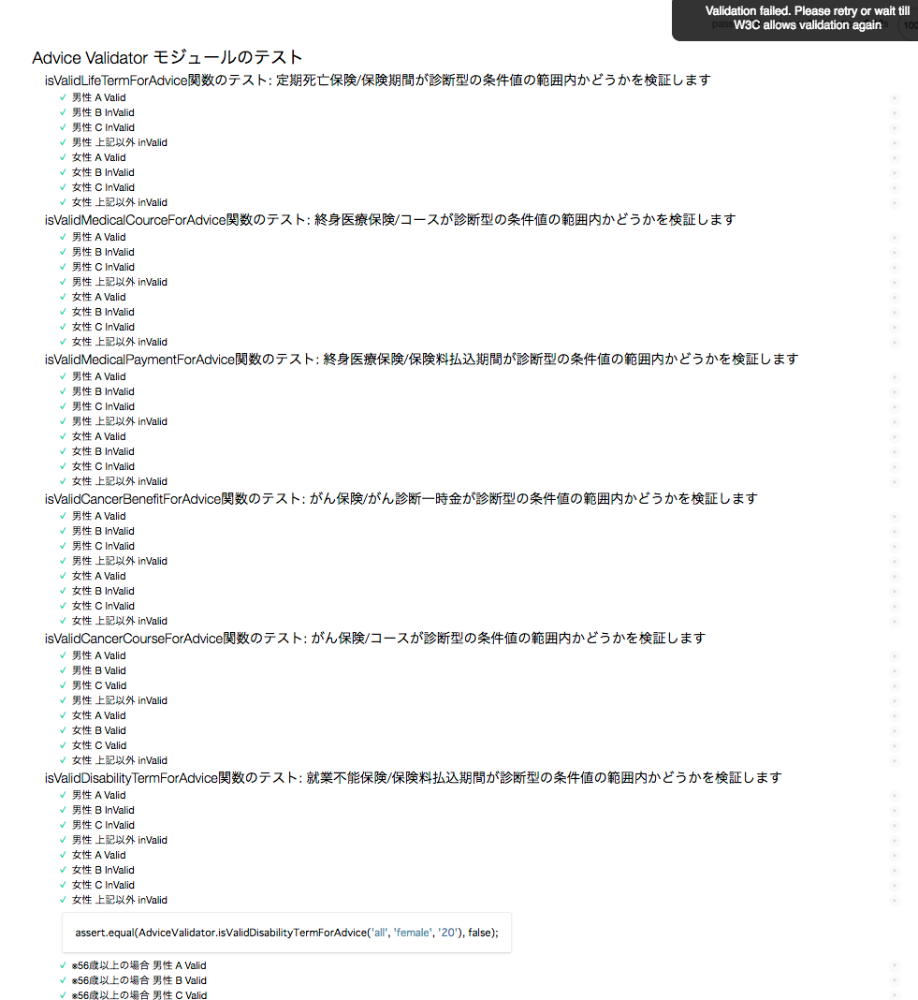

# Javascriptユニットテストコードサンプル（ブラウザ版）※ES6対応

## 1. 単体テストを行なう意義・目的

- 繰り返し手動テストを行なう手間を省力する（検証工数の削減）

  同じテストを手動で何度も行なうコストを削減できる。

- 確実なテストを行なう（機能品質の担保）

  手動テストで発生する人的なミスやテスト漏れなどをリスクを低減する。

- プログラムコードの品質を向上させる（保守性の担保）

  実装者が「テスト可能な（testable）コード」を意識することで、適切な粒度・責務に分割されたコードになり、メンテナンス性の向上に繋がる。

## 2. サンプルコードのリポジトリ

・bitbucket
https://bitbucket.org/moritanh/frontend_test

## 3. テストコードサンプル（ブラウザ版）

実ブラウザでテストを実行するタイプのサンプルコードです。
外部の依存ライブラリや依存スクリプトがあり、ブラウザで別ライブラリをロードする必要がある場合や、実環境に近い状態のテストを行いたい場合はこちらを使用することができます。

### ディレクトリ構成

- `browser-base`ディレクトリ

```
.
├── README.md // ... 本ドキュメント
├── package.json
└── sample
    ├── README.md
    ├── index.html  // テスト用ページ
    ├── js  // ... テスト対象のJavascript
    │   └── advice_validator.js
    ├── lib // ... 依存ライブラリ
    │   ├── config.js
    │   ├── jquery-3.2.1.min.js
    │   ├── multiplan.min.js
    │   └── plan_common.min.js
    └── test  // ... テストコード本体
        └── test.advice_validator.js
```

### 動作環境

### 使用するテストフレームワーク

`mocha` + `chai`のセットを使用しています。


### インストール

1. 必要npmモジュールのインストール

```
npm install mocha
npm install chai
npm install http-server
```
### テストの実行

ローカルサーバーを起動し、テストページ（index.html）を開くとブラウザ上でテストが実行されます。

```
npm start
```

ブラウザで`http://localhost:3000/sample/index.html`にアクセスします。
以下のようなテスト結果が表示されればテストは成功です。



----

## 5. テスト対象コードサンプル
